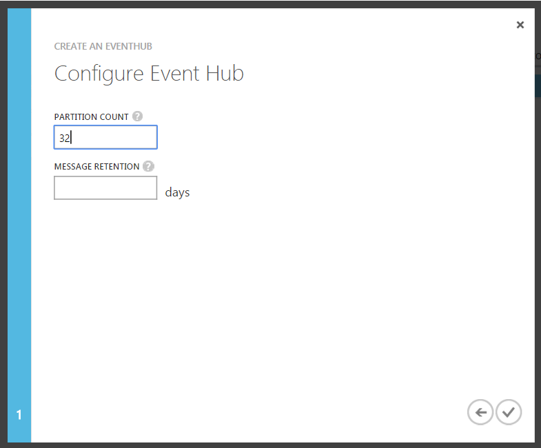
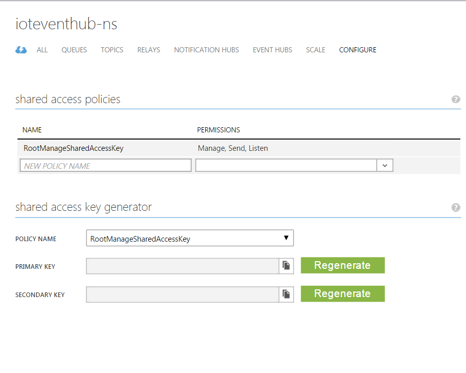

EventHubDashDemo
================

EventHubDashDemo provides code to visualize how [Azure Event Hubs](http://azure.microsoft.com/en-us/services/event-hubs/) enables very 
large scale data ingestion from a large number of sources and very high throughput event consumption 
through the use of partitioned consumers.

The Visual Studio solution contains three parts:

- Event Hubs Dashboard - an HTML/CSS Angular.js based dashboard which uses Service Bus queues to receive and send messages to worker roles.  
	- Uses [Damir Dobric's Service Bus Javascript SDK](https://github.com/ddobric/ServiceBusJavaScriptSdk/wiki/What-is-Azure-Service-Bus-JavaScript-SDK%3F) to communicate with worker roles from HTML 
	page using Service Bus queues.
- Sender/AzureLoadGenerator - an Azure worker role that sends events to the Azure Event Hub.
- Receivers/ProcessorWorkers - an Azure worker role that uses [EventProcessorHost](http://msdn.microsoft.com/en-us/library/azure/microsoft.servicebus.messaging.eventprocessorhost.aspx)
to consume events from the Azure Event Hub from a number of worker role instances in parallel.

The magic of this demonstration is that you can:

1. Create any number of producer worker roles to generate the desired size of the event stream.
2. Create any number of consumer worker roles to consume events from the Azure Event Hub.
3. Using the dashboard, start/stop each consuming worker role and visualize how EventProcessorHost manages 
partition leases.  As you add and start consumering worker role instances, partition leases are **automatically 
distributed increasing the overall consuming throughput.**

In order to visualize how partition leases migrate from one worker role to others, start a single consuming 
worker role and wait about 30 seconds until that worker role reads/consumers events from all partitions.  Then start the 2nd
consuming worker role and watch how, in about 30 seconds, reading from partitions are distributed using lease management among 
the two consuming worker roles.  You can create up to 20 consuming worker roles to maximize the consuming throughput.
Note: You'll need to increase the number of Throughput Units in your Azure Event Hub to realize the highest 
throughput available from 20 partitions.

Steps to configure the application in both Azure and the Visual Studio solution.

	1. Create (or reuse) a Service Bus namespace and save the name of the namespace.  
	We'll use it very shortly.

	2. Create the following Service Bus queues in the namespace from step 1:
		a. "stelemetryqueue"
		b. "controlqueue"

	3. Create (or reuse) an Azure Storage account and grab the connection string.
		a. Go to your Azure Storage account and click 'Manage Access Keys'.  This will open the 
		'Manage Access Keys' dialog.  Save the 'Storage Account Name' and 'Primary Access Key'.  
		You'll use it to create a storage connection string in a later step.

		
	4. Create Event Hub in the Service Bus namespace.
		a. Since the code uses the "ioteventhub" Event Hub create this event hub in your namespace.  
		This will save you from needing to change the references in the code.

			i. When creating your event hub,  use 'Custom Create' and on the second page of the 
			create wizard enter '32' as the value for the 'Partition Count' field.  Enter '1' for 
			the 'Message Retention' field.  

			

	5. Grab the SAS information for your namespace and update the .cscfg files for the worker 
	role configuration in the Visual Studio solution
		
		a. Click on 'Service Bus' in the main navigation of the Azure portal and you'll see your 
		Service Bus namespaces listed.  Don't open it yet.  Select the namespace which contains 
		your event hub and queues you created by clicking anywhere in the light-blue highlighting 
		(to the right of the namespace).  Then click on 'Connection Information' at the bottom of 
		the page.  This will open the 'Access connection information' for that specific Service 
		Bus namespace.  Under the 'SAS' section, copy the connection string for the 
		'RootManageSharedAccessKey' policy name.

			i. Update the following files in the Visual Studio solution with this connection string:
				1) Receivers | ProcessorWorkers | ServiceConfiguration.Cloud.cscfg and .Local.cscfg
				
				      <Setting name="ServiceBusConnectionString" 
							value="Endpoint=sb://[your service bus connection string]" />

				      <Setting name="AzureStorageConnectionString" 
							value="DefaultEndpointsProtocol=https;AccountName=[Storage Account Name];AccountKey=[Storage Account Primary Access Key]" />
				
				2) Sender | AzureLoadGenerator | ServiceConfiguration.Cloud.cscfg and .Local.cscfg
				
				      <Setting name="ServiceBusConnectionString" value="Endpoint=sb://[your service bus connection string]" />
				
			ii. Update the AzureStorageConnectionString in the cscfg using the storage account 
			name and primary access key.

			iii. Update "AzureStorageAccountLabel" and "AzureStorageAccountName" in 
			Sender | AzureLoadGenerator | Profiles | AzureLoadGeneratorProduction.azurePubxml.

			    <AzureStorageAccountLabel>[Your Azure Storage Account Name]</AzureStorageAccountLabel>
				<AzureStorageAccountName>[Your Azure Storage Account Name]</AzureStorageAccountName>

			iv. Update "AzureStorageAccountLabel" and "AzureStorageAccountName" in 
			Receivers| ProcessorWorkers| Profiles | ScaledTelemetryProduction.azurePubxml.

			    <AzureStorageAccountLabel>[Your Azure Storage Account Name]</AzureStorageAccountLabel>
				<AzureStorageAccountName>[Your Azure Storage Account Name]</AzureStorageAccountName>
			
	6. Update the keys in the javascript dashboard project in the Visual Studio solution
		a. Grab the SAS key for your namespaceIn the Azure portal, open the Service Bus namespace where you created the event hub.
			i. Click on the 'Configure' item at the right side of the top navigation menu.
			ii. By default, you'll have a 'RootManageSharedAccessKey' SAS policy name.
				1) Grab the policy 'name' and the 'primary key'.

		
		b. In the Visual Studio solution, open 'EHDash | Event Hubs Dashboard | Scripts | Keys.js

			i. Update the following 

			var eventHubNamespace = "<the Service Bus namespace which contains your event hub and queues>";
			var sasKey = "<primary key for RootManageSharedAccessKey>";
			var sasKeyName = "RootManageSharedAccessKey";

Thank you to my rock-star teammates, Dan Rosanova (original solar panel code), Clemens Vasters (async magic and finishing touches), 
Samar Abbas (help with EventProcessorHost), and Hillary Caituiro Monge (help with queues), for help on a number of aspects of the project.
